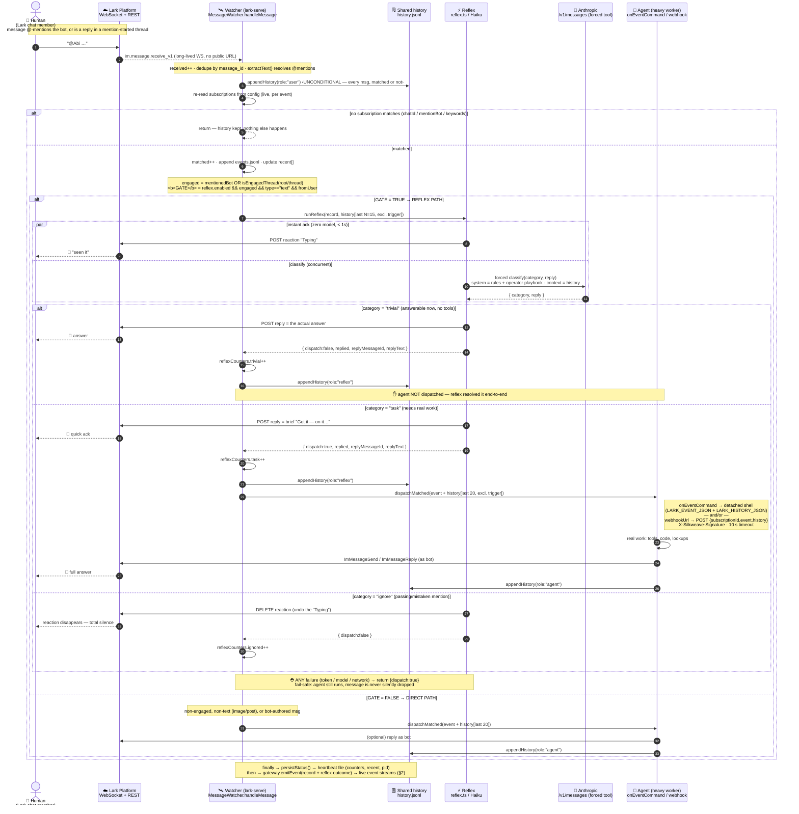
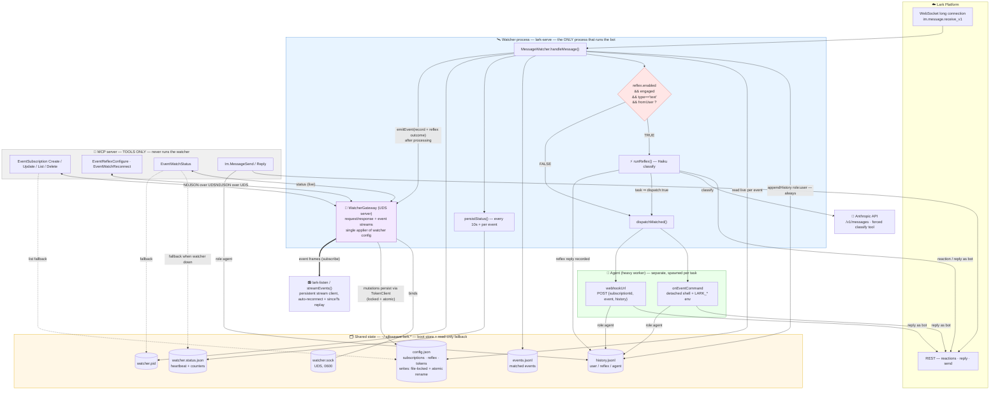

# Architecture — message flow & processes

How `@silkweave/lark` turns an inbound Lark message into a fast reflex reply and/or a delegated agent task. Two views: the **message-flow sequence** (user ↔ reflex ↔ agent) and the **process/state architecture**. Source of truth: `src/lib/messageWatcher.ts`, `src/lib/watcherGateway.ts`, `src/lib/watcherClient.ts`, `src/lib/reflex.ts`, `src/lib/history.ts`, `src/lib/watcherStatus.ts`.

## 1. Message flow — user ↔ reflex ↔ agent



**Annotations**

- **History is recorded unconditionally** (step 4), *before* subscription matching — the transcript is complete even for messages that never mention the bot. Reflex reads the last **15**; agent dispatch ships the last **20**; both **exclude the triggering message**.
- **Three roles in one shared log:** `user` (any chat member), `reflex` (Haiku's own fast replies, appended by the *watcher* after `runReflex` returns), `agent` (the heavy worker's replies, appended by whatever process runs `ImMessageSend/Reply`). This is what lets each layer see what the others said across processes.
- **Reaction and classification run in parallel** (`par`) — the "Typing" ack is a zero-model, sub-second "seen it" while Haiku is still thinking.
- **Only `task` crosses into the agent.** `trivial` and `ignore` terminate inside reflex (`dispatch:false`). `task` returns `dispatch:true`, and the *watcher* (not reflex) spawns the workload.
- **Reflex is text-only** (`type=="text"` in the gate): image/`post` mentions skip reflex entirely and fall to the DIRECT path — no reaction, no classification.
- **`fromUser`** in the gate stops the bot from reflex-replying to its own or the agent's messages (loop guard).
- **Fail-safe bias:** every reflex error path returns `dispatch:true`. The system would rather over-dispatch to the agent than drop a real request.
- **Event streaming happens last.** The event (with the reflex outcome — category, replied, replyText, dispatched) is fanned out to gateway stream subscribers only *after* processing completes, so a streaming agent always sees what the reflex already did. Unmatched messages are also fanned out to `deliver: "all"` streams (full-transcript consumers) even though they are never persisted to `events.jsonl`.

## 2. Process & state architecture



**Annotations**

- **The gateway is the control plane.** The running watcher hosts a Unix-domain-socket server (`~/.silkweave-lark.watcher.sock`, mode 0600, NDJSON request/response — see `src/types/gateway.ts`). MCP `Event*` tools are thin clients (`src/lib/watcherClient.ts`): connect, one request, one response, close. Detection = "can I connect?". The watcher is the **single applier** of subscription/reflex config while running — mutations are serialized on its event loop (no lost updates between concurrent MCP agents) and persisted to `config.json` via a file-locked, atomic-rename write.
- **Watcher-down behavior:** mutations (`subscriptions.add/update/remove`, `reflex.set`, `reconnect`) **hard-fail** with the exact start command (`START_HINT`); read-only tools (`EventWatchStatus`, `EventSubscriptionList`) fall back to the heartbeat/config files (dotted arrows).
- **Event streaming:** a persistent client `subscribe`s with a filter (`deliver: matched|all`, chatId, subscriptionId, mentionedBot, includeHistory) and receives each event as a frame *after* the watcher finishes processing it — including the reflex outcome. Reconnects pass the last-seen `receivedAt` as `sinceTs`; the gateway replays matched events from `events.jsonl` (inclusive bound, client dedupes by messageId) so matched delivery is gap-free across watcher restarts. Slow consumers get an `overflow` frame and are disconnected (they catch up via `sinceTs`); heartbeat frames flow every 15 s.
- **The token store is still multi-writer** (MCP OAuth, watcher token refresh) — every `TokenClient` mutation re-reads the file under an `O_EXCL` lockfile (`withFileLock`, stale takeover after 10 s), applies the change to fresh state, and atomic-writes. This closes the token-refresh-vs-OAuth clobber independent of the gateway.
- **Two dispatch mechanisms, not mutually exclusive.** A subscription can set `onEventCommand` **and** `webhookUrl`; both fire for the same event. Command = spawn-per-message (fresh agent each time); webhook = one persistent listener backing a long-running agent. Streaming is a third, pull-style consumer that doesn't need a public URL or per-message process.
- **History is the shared memory** unifying the three layers: reflex writes what it said, the agent writes what it said, and both read the same log so context survives across the process boundary and across time.
- **Heartbeat freshness = liveness (fallback).** `persistStatus()` stamps `heartbeatAt` every 10 s; a file reader treats the watcher as "running" only if the pid is alive **and** the heartbeat is < 35 s old. The gateway's `status` method reports live, on-demand state (plus `wsConnected`, `activeStreams`) when the watcher is up.

## Starting the watcher

The watcher is a standalone OS process, never started by the MCP server (see [README → Running the watcher](../README.md#running-the-watcher)). It starts **bare** — no arguments needed — and is then configured live over the gateway:

```sh
lark-serve                                   # installed
pnpm serve                                   # dev checkout
lark-serve --reflex --api-key sk-ant-... --playbook ./playbook.md   # optional pre-seeds
lark-listen --all                            # stream every inbound message as NDJSON
```

Stop with `Ctrl-C` or `kill $(cat ~/.silkweave-lark.watcher.pid)`. Check it with the `EventWatchStatus` tool — when it's down, `notRunningReason` carries the exact start command.
